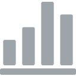
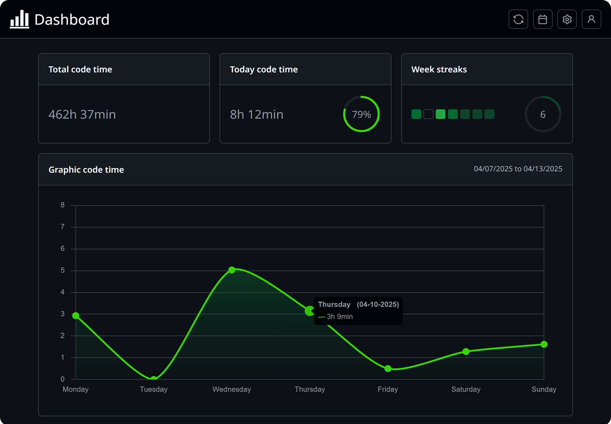
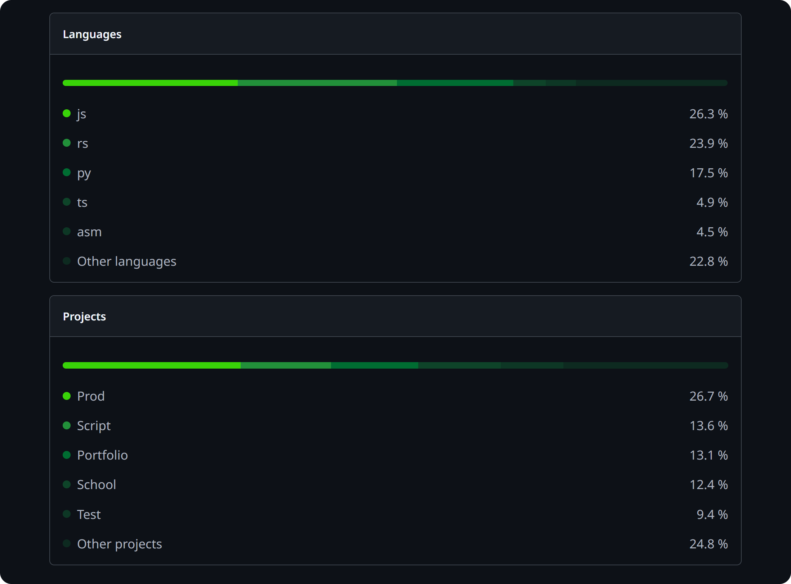

    

<h1 align="center">Statice</h1>

Statice is a time-tracking extension for Visual Studio Code to explore your coding habits, visualize your stats, and boost your productivity.

Join our community of developers who use Statice to study and manage their stats.

## Dashboard preview

    
    

- `Total code time module`: Displays total time spent on Visual Studio Code.

- `Today code time module`: Displays your coding time today and compares to your average daily coding time over your last 30 active days. 

    This helps you track how consistently you’re coding day‑to‑day, aim for around 100% or more each day to build and maintain a steady habit.

> [!NOTE]
> An active day refers to any day during which coding activity was tracked.

- `Week streaks module`: The Week Streaks module tracks your consistency over time. A week streak is completed when you log at least one active day for every day in a given week.

    The current week is visually represented, with each day shown as a colored cell, the brighter or more intense the color, the more time you spent coding that day. 

    Next to the graph, you’ll also see your total number of week streaks achieved compared to the total number of weeks in the current year, helping you gauge your long-term consistency.

- `Graphic code time module`: Visualize the time you spent every day this week or on the interval specified on the calendar. Hover the points on the curve to display precise values and days.

- `Bar chart modules`: The first chart highlights your most frequently used programming languages, showing the proportion of time spent on each as a percentage of your total coding time.

    The second chart showcases the projects you've worked on the most, also represented as a percentage of your overall coding activity.

## Safe, Secure, and Free

Statice does not collect any data. For statistical purposes only, it identifies the file extensions you’re working with and the names of your open projects. All data is stored locally on your machine — never shared, never uploaded.

And best of all, Statice is completely free to use !

## Extension Settings

Statice offers a direct interface for managing the extension's settings.

This extension contributes the following settings:

- `statice.theme`: Change extension dashboard theme.
- `statice.notifications`: Enable/disable all the notifications that do not display an error or important informations.

 Developed by <a href="https://github.com/devpotatoes">dev.potatoes
